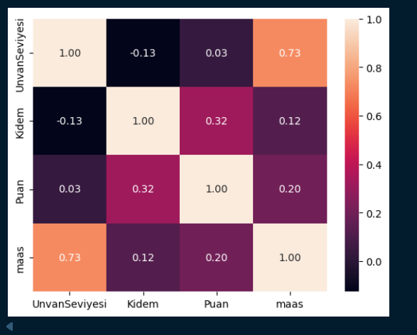
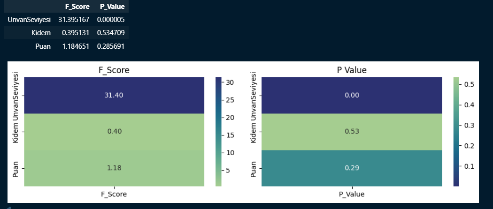
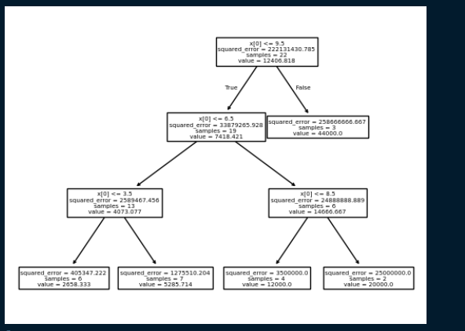
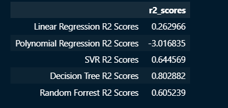

# 📈 Advanced Salary Prediction & Comparative Regression Analysis


Çalışanların unvan seviyelerine göre maaş tahmini yapmayı ve farklı regresyon modellerinin performanslarını karşılaştırmayı amaçlayan bir veri analizi ve makine öğrenimi projesidir.

---

## 📌 Proje Özeti

| Aşama | Açıklama |
|---|---|
| **Veri Ön İşleme & EDA** | `maaslar_yeni.csv` incelenir; `UnvanSeviyesi`, `Kidem`, `Puan` ve `maas` değişkenleri arasındaki ilişkiler analiz edilir. |
| **Özellik Seçimi** | Korelasyon matrisi ve F-testi (F-Score / P-Value) ile hangi değişkenlerin maaşı açıkladığı belirlenir. |
| **Modelleme** | Linear Regression, Polynomial Regression, SVR, Decision Tree ve Random Forest modelleri eğitilir. |
| **Değerlendirme** | Modeller R^2 skoru ile karşılaştırılır. |
| **Görselleştirme** | Korelasyon ısı haritası, F-testi ısı haritaları ve karar ağacı çizimi hazırlanır. |

---

## 🛠️ Teknolojiler

- **Python:** 3.10.11
- **Veri işleme:** `pandas`, `numpy`
- **Görselleştirme:** `matplotlib`, `seaborn`
- **Makine öğrenimi:** `scikit-learn`

---

## 📂 Proje Yapısı

```text
.
├── assets/               # README görselleri
├── maaslar_yeni.csv      # Veri seti
├── notebooks.ipynb       # Veri analizi, modelleme ve görselleştirme adımları
├── requirements.txt      # Proje bağımlılıkları
├── LICENSE               # MIT lisansı
└── README.md             # Proje dokümantasyonu
```

---

## 🚀 Kurulum ve Çalıştırma

```bash
# 1. Depoyu klonlayın
git clone <repo-url>
cd <repo-klasoru>

# 2. (Önerilir) Sanal ortam oluşturun
python -m venv venv
source venv/bin/activate        # Windows: venv\Scripts\activate

# 3. Bağımlılıkları yükleyin
pip install -r requirements.txt

# 4. Notebook'u açın
jupyter notebook notebooks.ipynb
```

---

## 🔍 Bulgular

### 1. Değişkenler arası korelasyon



`UnvanSeviyesi` ile `maas` arasında güçlü bir pozitif ilişki vardır (**0.73**). `Kidem` (0.12) ve `Puan` (0.20) ile maaş arasındaki ilişki zayıftır.

### 2. F-testi ile özellik önemi



| Özellik | F-Score | P-Value |
|---|---|---|
| UnvanSeviyesi | 31.395 | 0.000005 |
| Kidem | 0.395 | 0.5347 |
| Puan | 1.185 | 0.2857 |

Yalnızca `UnvanSeviyesi` istatistiksel olarak anlamlıdır (p < 0.05). `Kidem` ve `Puan` maaşı anlamlı biçimde açıklamamaktadır.

### 3. Karar ağacı



Ağaç, tüm bölünmelerde yalnızca `UnvanSeviyesi` (`x[0]`) özelliğini kullanmaktadır. Bu da F-testi sonucunu destekler.

---

## 📊 Model Karşılaştırması



| Model | $R^2$ |
|---|---|
| Linear Regression | 0.263 |
| Polynomial Regression | -3.017 |
| SVR | 0.645 |
| Random Forest | 0.605 |
| **Decision Tree** | **0.803** |

**Yorum:** En yüksek R^2 skorunu Decision Tree vermiştir. Polynomial Regression'ın negatif $R^2$ değeri, modelin ortalamayı tahmin etmekten bile kötü performans gösterdiğini ve aşırı öğrenme (overfitting) yaşadığını gösterir. Veri seti küçük olduğu için sonuçlar tek bir veri bölünmesine duyarlı olabilir; çapraz doğrulama (cross-validation) ile teyit edilmesi önerilir.

---

## 📄 Lisans

Bu proje [MIT Lisansı](LICENSE) ile lisanslanmıştır.
